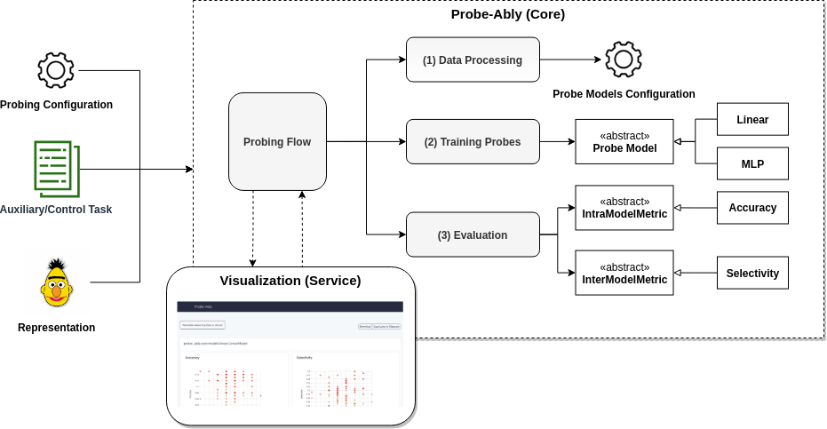

# Probe-Ably

_Probe-Ably_ is a framework designed to support researchers in the implementation of probes for neural representations in a flexible and extensible way.

The core facility provided by _Probe-Ably_ is the encapsulation of the end-to-end experimental probing pipeline. Specifically, _Probe-Ably_ provides a complete implementation of the core tasks necessary for probing neural representations, starting from the configuration and training of heterogeneous probe models, to the calculation and visualization of metrics for the evaluation.

The probing pipeline and the core tasks operate on a set of abstract classes, making the whole framework agnostic to the specific representation, auxiliary task, probe model, and metrics used in the concrete experiments.

## Architecture Diagram

This architectural design allows the user to:

- Configure and run probing experiments on different representations and auxiliary tasks in parallel;
- Automatically generate control tasks for the probing, allowing the computation of inter-model metrics such as Selectivity;
- Extend the suite of probes with new models without the need to change the core probing pipeline;
- Customize, implement and adopt novel evaluation metrics for the experiments.

Further information can be found in the [Docmentation](https://ai-systems.github.io/Probe-Ably/).
